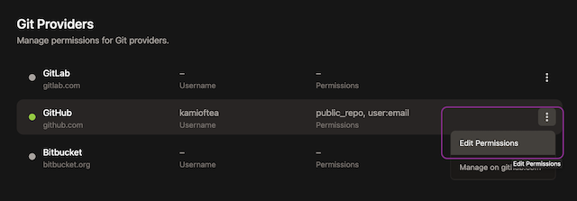
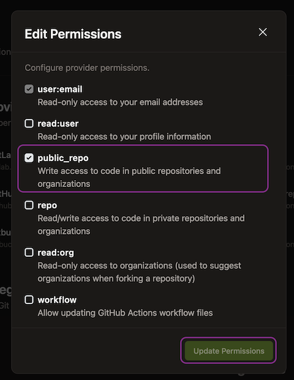
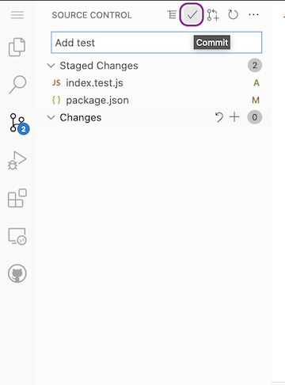

# BCS Sheffield Hackathon - Node Template (12/04)

## The Challenge

Digital graphics tools often make available a "bucket fill" tool that will only paint adjacent cells. In one fill, a
modified bucket tool recolours adjacent cells (connected horizontally or vertically but not diagonally) that have the
same colour. Given a picture represented as a 2-dimensional array of letters representing colours, find the minimum
number of fills to completely repaint the picture.

### Constraints

* `h` and `w` refer to height and width of the graph.
* 1 ≤ `h` ≤ 105
* 1 ≤ `w` ≤ 105
* 1 ≤ `h * w` ≤ 10<sup>5</sup>
* `length(picture[i]) = w` (where 0 ≤ `i` < `h`)
* `picture[i][j]` is in the set `{'a', 'b', 'c'}` (where 0 ≤ `i` < `h` and 0 ≤ `j` < `w`)

### Example

Each string represents a row of the picture and each letter represents a cell's colour. The diagram below shows the 5
fills needed to repaint the picture. It takes two fills each for a and b, and one for c. The input for the picture is
shown below.

#### Input:

```
3
aabba
aabba
aaacb
```

: 5' and the cells are coloured in five blocks showing the five strokes required. The block of seven a's on the left is green, the top middle block of four b's is red, the top right block of two a's is light blue, and the single cell blocks of c and b in the bottom right are pale yellow and orange respectively.")

Note that you will not need to read and parse the sample files yourself.
[samples.test.js:loadSamples](https://github.com/jeff-horton-ho-sas/sheffield-hackathon-node/blob/main/samples.test.js#L5)
will parse the input and call
[index.js:strokesRequired](https://github.com/jeff-horton-ho-sas/sheffield-hackathon-node/blob/main/index.js#L1)
with the picture array described in the constraints.

#### Output:

`5`

## Getting started

1. Fork the repository
   

2. Open in Gitpod: Add `https://gitpod.io/#` in front of the url to your fork. E.g. if your fork is
   `https://github.com/kamioftea/sheffield-hackathon-node` use
   `https://gitpod.io/#https://github.com/kamioftea/sheffield-hackathon-node` to open your fork in Gitpod.

3. Once Gitpod loads, it should automatically start [Jest](https://jestjs.io/) running in the bottom of your screen.
   This will watch for code changes and re-run the sample images through your solution when you save your file.

4. Open [index.js](./index.js) and start hacking!

## Testing your code

The sample tests will tell you if your solution is valid. If you want to test parts of your solution as you go you can
add extra tests. [Jest](https://jestjs.io/) will automatically pick up any file with the extension `.test.js`. In those
files the `describe` (for grouping tests), `test` (for defining a test) and `expect` (for testing an assertion)
functions are made available by Jest. Examples of how to use `expect` can be found here
[Jest - Using Matchers](https://jestjs.io/docs/using-matchers). For example, say you are adding a function that returns
the adjacent cells to a given cell. You create the function in `index.js`.

```javascript
export function getAdjacentCells(x, y, picture) {
    // TODO
}
```

To write a test for this you can add `index.test.js`:

```javascript
import {getAdjacentCells} from './index.js'

// Both describe and test take a string label, so that you can identify what is passing/failing, and a function to run
// the group or test respectively.
describe("getAdjacentCells", () => {
   const EXAMPLE_PICTURE = [
      'a', 'b', 'c',
      'a', 'a', 'c',
      'a', 'a', 'a',
   ]

   test("Can find adjacent cells", () => {
      const result = getAdjacentCells(1, 1, EXAMPLE_PICTURE);
      
      expect(result.length).toBe(4)
      expect(result.toContain([0, 1]))
      expect(result.toContain([1, 0]))
      expect(result.toContain([2, 1]))
      expect(result.toContain([1, 2]))
   })
   
   test("Can find adjacent cells on the edge of the picture", () => {
      const result = getAdjacentCells(0, 0, EXAMPLE_PICTURE);
      
      // TODO: add more expect calls here to verify the result
   })
})

// as you add other functions, you can add more describe / test entries here
```
The Jest test runner in the terminal should automatically detect the new file and run the tests it includes. The tests 
will fail at first because there isn't an implementation for `getAdjacentCells` yet. Once you add one, Jest will re-run 
the tests, and they should start to pass.

If you need to restart the tests for any reason, run `npm test` in the terminal.
 
## Submitting your solution

You will need to allow GitPod permission to push to your repository. Go to 
[Gitpod Integrations](https://gitpod.io/integrations) and add public_repo permissions:



You can then commit your changes and push them to GitHub from within Gitpod.

1. From the source control side panel, stage your changes to the commit and add a commit message:
   
2. Commit the changes:
   
3. Synchronise the commit with GitHub:
   

## Powered / Supported By

<a href="https://www.bcs.org/membership-and-registrations/member-communities/south-yorkshire-branch/"></a>
&emsp;
<a href="https://www.gitpod.io/"></a>

### Facilitators:

- Gareth Coleman, Maker, coder and educator, https://bitfixit.org.uk/
- Eva M. Barabas MBCS, Principal Engineer UK Home Office, Vice-chair - BCS South Yorkshire Committee, https://twitter.com/b_seven_e

### Mentors / Judges

- Neil Bizzell MBCS, Director of Education Developer Academy, https://www.linkedin.com/in/neilbizzell/
- Liam MacPherson MBCS, Senior Developer UK Home Office, https://www.linkedin.com/in/liammacpherson/
- Jeff Horton, Developer UK Home Office, https://twitter.com/KamiOfTea
- Aaron Robinson, Automation Developer UK Home Office, https://github.com/ARobinson26